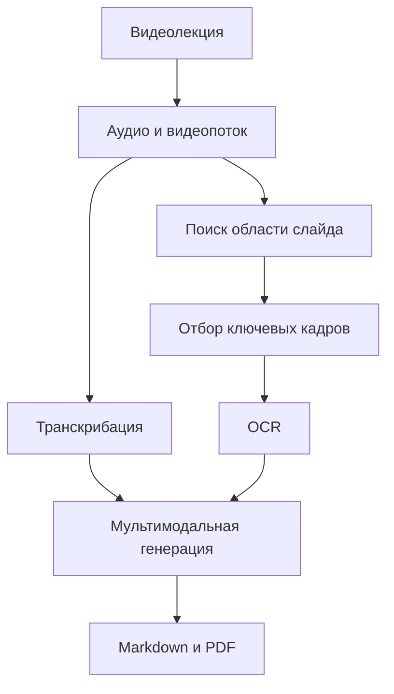

# LectureNote AI

Веб-приложение для автоматического создания конспектов видеолекций. Система извлекает аудио и значимые кадры, распознаёт речь и текст на слайдах, формирует мультимодальный конспект и сохраняет результат в Markdown и PDF.

Проект разработан в рамках магистерской работы по направлению «Искусственный интеллект и машинное обучение».

## Возможности

- загрузка видеолекций через веб-интерфейс;
- фоновая обработка задач с помощью Celery и Redis;
- транскрибация речи;
- поиск области слайда и отбор содержательно значимых кадров;
- коррекция перспективы и обрезка кадров;
- OCR-распознавание текста на слайдах;
- генерация структурированного конспекта с помощью LLM;
- экспорт результата в Markdown и PDF;
- регистрация, авторизация и профиль пользователя;
- приватная библиотека, избранное, теги и уведомления;
- защищённый доступ к материалам владельца;
- удаление исходного видео после окончания обработки.

## Пайплайн



Серверный адаптер `summaries/services/pipeline.py` связывает веб-приложение с ML-модулями обработки аудио, кадров, OCR и генерации итогового конспекта.

## Технологии

- Python, Django;
- Celery, Redis;
- OpenCV, TensorFlow/Keras, Pillow;
- OCR и обработка аудио;
- Qwen или Mistral;
- WeasyPrint, ReportLab;
- HTML, CSS, JavaScript.

## Структура

```text
config/                    настройки Django и Celery
summaries/                 модели, формы, представления и фоновые задачи
summaries/services/        интеграция ML-пайплайна и генерация PDF
image_processing/          анализ слайдов, OCR и отбор кадров
text_processing/           обработка аудио и текста
static/                    стили и клиентский JavaScript
main.py                    запуск исходного ML-пайплайна
multimodal_summary.py      генерация мультимодального конспекта
manage.py                  управление Django-приложением
```

## Требования

- Python 3.10+;
- Redis 7+;
- FFmpeg в `PATH`;
- доступная LLM и модель ключевых точек.

`requirements.txt` содержит зависимости веб-части. ML-пайплайн использует дополнительные библиотеки исходного исследовательского окружения, включая OpenCV и TensorFlow/Keras.

## Установка

Windows:

```powershell
python -m venv .venv
.venv\Scripts\activate
pip install -r requirements.txt
copy .env.example .env
```

Linux/macOS:

```bash
python -m venv .venv
source .venv/bin/activate
pip install -r requirements.txt
cp .env.example .env
```

Настройте `.env`:

```env
DEBUG=1
SECRET_KEY=change-me
ALLOWED_HOSTS=127.0.0.1,localhost
CELERY_BROKER_URL=redis://127.0.0.1:6379/0
CELERY_RESULT_BACKEND=redis://127.0.0.1:6379/1
PIPELINE_ROOT=D:/projects/lecture-note-ai
KEYPOINTS_MODEL_PATH=D:/models/best.weights.h5
DEFAULT_LLM_MODEL=qwen
```

Не добавляйте `.env`, ключи и пароли в Git.

Подготовьте базу и Redis:

```bash
python manage.py migrate
python manage.py createsuperuser
docker compose up -d redis
```

Запустите Django:

```bash
python manage.py runserver
```

В отдельном терминале запустите обработчик задач:

```bash
celery -A config worker -l info --pool=solo
```

Приложение будет доступно по адресу `http://127.0.0.1:8000/`.

## Основные маршруты

| Маршрут | Назначение |
|---|---|
| `/dashboard/` | личная библиотека |
| `/upload/` | загрузка видеолекции |
| `/favorites/` | избранные материалы |
| `/notes/<id>/` | просмотр конспекта |
| `/notifications/` | уведомления |
| `/accounts/profile/` | профиль пользователя |

## Приватность и ограничения

Каждый пользователь видит только собственные материалы. Выдача PDF, Markdown, транскрипции и журналов проверяет владельца объекта. Загруженное видео удаляется после успешной обработки или ошибки.

Проект ориентирован на локальный исследовательский запуск. Качество результата зависит от записи, читаемости слайдов, OCR и выбранной LLM. Для промышленного развёртывания потребуются production-настройки базы данных, файлового хранилища, HTTPS и сервера приложений.

## Лицензия

Учебный и исследовательский проект. Условия повторного использования следует согласовать с автором.
